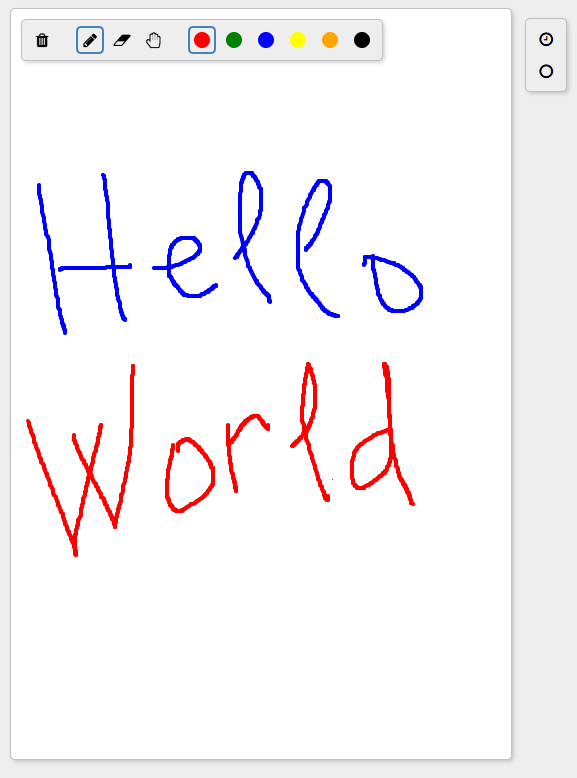

# Drawing board demo

Collaborative drawing board demo app.

- only an example for learning and traning
- doesn't depend on any UI frameworks, pure HTML
- based on [PartiKit](https://docs.partykit.io/) web server
- uses [Yjs](https://github.com/yjs/yjs) as a collaborative framework

Initial project was a stub created as [described](https://docs.partykit.io/quickstart/) via `npm create partykit@latest` then changed as neeeded.

Dev run:

```bash
npm run dev

# Navigate to localhost:1999
```

Deploy on PartyKit to test across the web (free deploys are time limited):

```bash
npm run deploy

# Navigate to the address it shows
```



## Links

### Docs and articles

RTFM and usefult tips:

- [Canvas](https://developer.mozilla.org/en-US/docs/Web/HTML/Element/canvas)
- [Canvas spec](https://html.spec.whatwg.org/multipage/canvas.html)
- [Font Awesome Icons](https://fontawesome.ru/all-icons/)


### Expiration sources

For taking ideas and stealing code samples:

- [TLDraw](https://github.com/tldraw/tldraw)
- [Whiteboard](https://github.com/cracker0dks/whiteboard)
